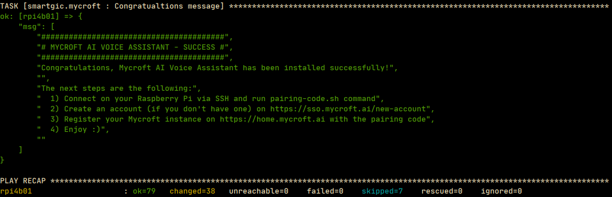
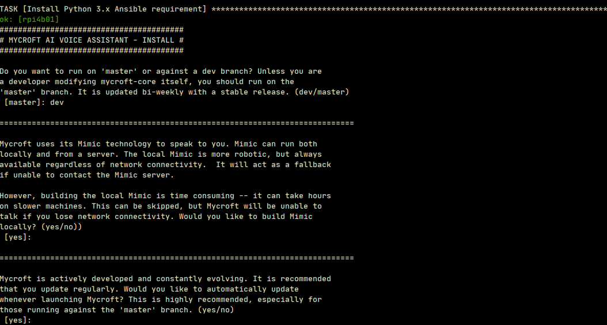

# Ansible playbooks for Mycroft AI Voice Assistant

- [Ansible playbooks for Mycroft AI Voice Assistant](#ansible-playbooks-for-mycroft-ai-voice-assistant)
  * [Introduction](#introduction)
    + [What does Ansible `prepi` role?](#what-does-ansible--prepi--role-)
    + [What does Ansible `mycroft` role?](#what-does-ansible--mycroft--role-)
  * [Requirements](#requirements)
  * [Example Playbooks](#example-playbooks)
    + [Playbook with default values](#playbook-with-default-values)
    + [Playbook with custom values](#playbook-with-custom-values)
    + [Playbook with `picroft` role only](#playbook-with--picroft--role-only)
    + [Playbook with `mycroft` role only](#playbook-with--mycroft--role-only)
    + [Playbook to uninstall Mycroft](#playbook-to-uninstall-mycroft)
  * [License](#license)
  * [Author Information](#author-information)
## Introduction
These Ansible playbooks will help you to install and configure Mycroft AI Voice Assistant on a Raspberry Pi 4B *(and later)* board with Raspberry Pi OS distribution.

Two types of playbook:
  - **Interactive**: asking questions to configure the roles used by the playbook
  - **Non-interactive**: using the default values from the roles or extra variables which override the default values

The playbooks could call different roles such as [prepi](https://github.com/smartgic/ansible-role-prepi) and [mycroft](https://github.com/smartgic/ansible-role-mycroft), these roles are available on [Ansible Galaxy](https://galaxy.ansible.com/smartgic) too.

Before running the playbooks, please have a look to the README of both of roles listed above.

The following image is the result of the install playbook execution:



### What does Ansible `prepi` role?

Using the `prepi` Ansible role will ensure your Raspberry Pi to be properly configured for the best of Mycroft experience.

The role will perform the following tasks _(depending your wish)_:

- Update Raspberry Pi OS to the latest version
- Add Debian backports repository _(customizable)_
- Update firmware using the `next` branch which provide kernel 5.10 _(customizable)_
- Update EEPROM using the `beta` version _(customizable)_
- Setup `initial_turbo` to speedup the boot process
- Overclock the Raspberry Pi to 2Ghz _(customizable)_
- Mount `/tmp` on a RAMDisk for Mycroft TTS cache files
- Optimize `/` partition mount options to improve SDcard read/write
- Enable I2C, SPI & UART interfaces _(customizable)_
- Set CPU governor to `performance` to avoid context switching between the `idle*` kernel functions _(customizable)_
- Install and configure PulseAudio (non-system wide) _(customizable)_

### What does Ansible `mycroft` role?

The role will perform the following tasks:

- Install and configure Mycroft AI Voice Assistant
- Myroft services integrated with systemd
- Extra skills installation
- `boto3`, `py_mplayer` and `pyopenssl` Python librairies installation
- RAMDisk support for IPC
- Configure Mycroft with custom user profile
- Optimize PulseAudio for Mycroft
- Protect Mycroft message bus service port `8181`

## Requirements

- Raspberry Pi 4B board and later connected to your network
- [Raspberry Pi OS 64-bit](https://downloads.raspberrypi.org/raspios_arm64/images) _(required for board with more than 4GB of RAM)_
- Ansible 2.9 minimum *(follow [this guide](https://docs.ansible.com/ansible/latest/installation_guide/intro_installation.html))*
- SSH up and running *([howto enable SSH on Raspberry Pi](https://www.raspberrypi.org/documentation/remote-access/ssh))*

This repository provides a `requirements.yml` file which allows you to retrieve the roles from Ansible Galaxy `Smart'Gic` namespace.

```
$ cd ansible-playbooks-mycroft
$ ansible-galaxy install -r requirements.yml
```

## Example Playbooks

Inventory file with `rpi` group which has one host named `rpi4b01` with the IP address `192.168.1.97`.

```
[rpi]
rpi4b01 ansible_host=192.168.1.97 ansible_user=pi
```

Basic playbook running on `rpi` group using the `pi` user to connect via SSH _(based on the inventory)_ with some custom variables.

### Interactive playbook

Using the interactive _(asking questions)_ playbook to install and configure Mycroft.

```
$ cd ansible-playbook-mycroft
$ ansible-playbook -i inventory install-interactive.yml
```




### Playbook with default values

Prepare Raspberry Pi, install and configure Mycroft with the default values from the roles.
```
---
# file: install-default.yml
- hosts: rpi
  gather_facts: no
  become: yes

  pre_tasks:
    - name: Install Python 3.x Ansible requirement
      raw: apt-get install -y python3
      changed_when: no
      tags:
        - always

- hosts: rpi
  become: yes

  tasks:
    - import_role:
        name: smartgic.prepi

    - import_role:
        name: smartgic.mycroft
```

Run the playbook
```
$ cd ansible-playbooks-mycroft
$ ansible-playbook -i inventory install-default.yml
```

### Playbook with custom values

Prepare Raspberry Pi, install and configure Mycroft with some custom values from the roles.
```
---
# file: install-custom.yml
- hosts: rpi
  gather_facts: no
  become: yes

  pre_tasks:
    - name: Install Python 3.x Ansible requirement
      raw: apt-get install -y python3
      changed_when: no
      tags:
        - always

- hosts: rpi
  become: yes

  vars:
    # PREPI
    prepi_pi_user: pi
    prepi_hostname: mylovelypi
    prepi_firmware_update: no
    prepi_overclock: yes
    prepi_cpu_freq: 1750

    # MYCROFT
    mycroft_branch: dev
    mycroft_user: "{{ prepi_pi_user }}"
    mycroft_skills_update_interval: 2.0
    mycroft_recording_timeout_with_silence: 3.0
    mycroft_log_level: DEBUG
    mycroft_name: picroft
    mycroft_extra_skills:
      - https://github.com/MycroftAI/skill-homeassistant.git

  tasks:
    - import_role:
        name: smartgic.prepi

    - import_role:
        name: smartgic.mycroft
```

Run the playbook
```
$ cd ansible-playbooks-mycroft
$ ansible-playbook -i inventory install-custom.yml
```

### Playbook with `picroft` role only

Install and configure Mycroft with some custom values from the roles.
```
---
# file: prepi-only.yml
- hosts: rpi
  gather_facts: no
  become: yes

  pre_tasks:
    - name: Install Python 3.x Ansible requirement
      raw: apt-get install -y python3
      changed_when: no
      tags:
        - always

- hosts: rpi
  become: yes

  vars:
    # PREPI
    prepi_pi_user: pi
    prepi_hostname: mylovelypi
    prepi_firmware_update: no
    prepi_overclock: yes
    prepi_cpu_freq: 1750
```

Run the playbook
```
$ cd ansible-playbooks-mycroft
$ ansible-playbook -i inventory prepi-only.yml
```

### Playbook with `mycroft` role only

Install and configure Mycroft with some custom values from the roles.
```
---
# file: mycroft-only.yml
- hosts: rpi
  gather_facts: no
  become: yes

  pre_tasks:
    - name: Install Python 3.x Ansible requirement
      raw: apt-get install -y python3
      changed_when: no
      tags:
        - always

- hosts: rpi
  become: yes

  vars:
    mycroft_branch: dev
    mycroft_user: pi
    mycroft_skills_update_interval: 2.0
    mycroft_recording_timeout_with_silence: 3.0
    mycroft_log_level: DEBUG
    mycroft_name: picroft
    mycroft_extra_skills:
      - https://github.com/MycroftAI/skill-homeassistant.git

    - import_role:
        name: smartgic.mycroft
```

Run the playbook
```
$ cd ansible-playbooks-mycroft
$ ansible-playbook -i inventory mycroft-only.yml
```

### Playbook to uninstall Mycroft

Uninstall Mycroft with extra variable passed on the command line.
```
---
# file: uninstall.yml
---
- hosts: rpi
  gather_facts: no
  become: yes

  tasks:
    - meta: end_play
      when: mycroft_uninstall is undefined or mycroft_uninstall | bool == false

    - import_role:
        name: smartgic.mycroft
        tasks_from: uninstall
      when: mycroft_uninstall is defined and mycroft_uninstall | bool
```

Run the playbook
```
$ cd ansible-playbooks-mycroft
$ ansible-playbook -i inventory uninstall.yml -e mycroft_uninstall=yes
```

## License

MIT

## Author Information

I'm [Gaëtan Trellu (goldyfruit)](https://smartgic.io/), let's discuss :) - 2020